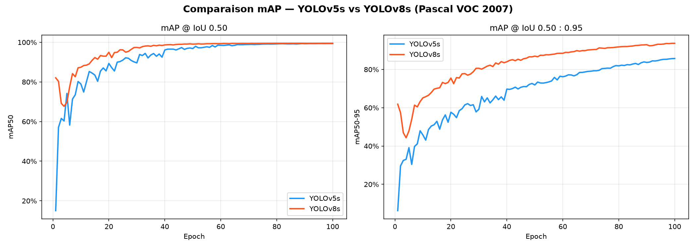
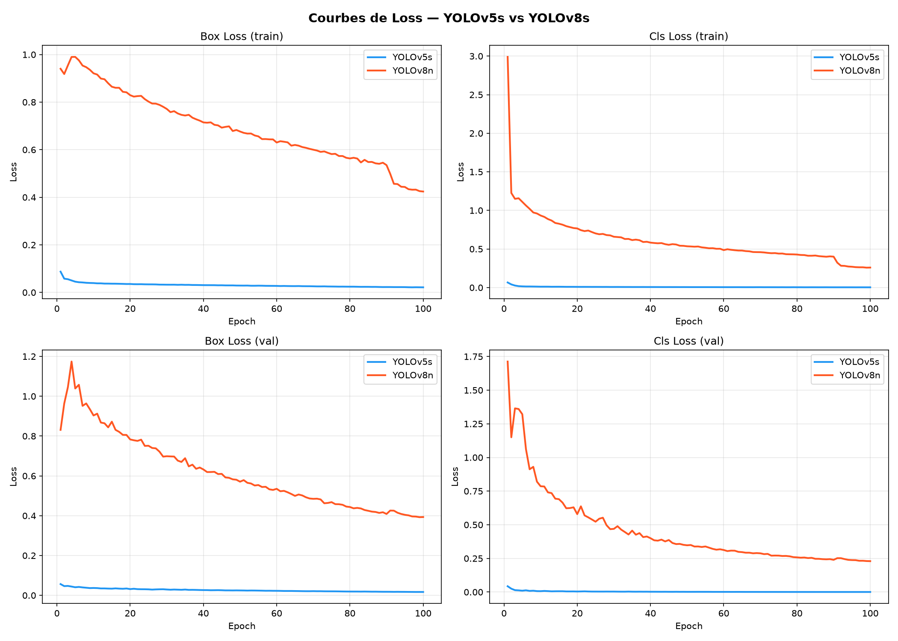
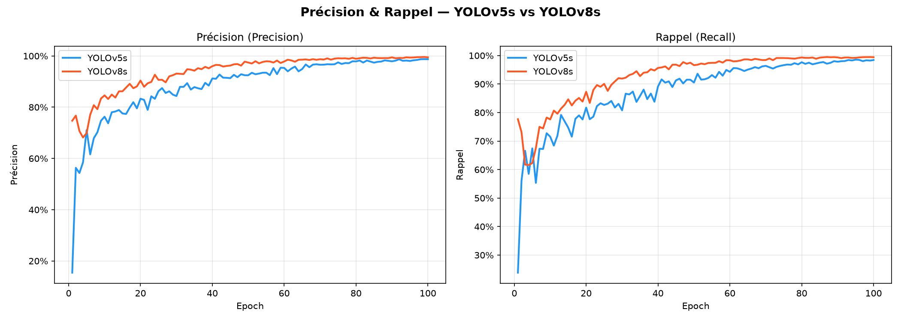

# Analyse Comparative — YOLOv5s vs YOLOv8s sur Pascal VOC 2007

## Contexte expérimental

| Paramètre | Valeur |
|---|---|
| Dataset | Pascal VOC 2007 (~5 000 images, 20 classes) |
| Epochs | 100 |
| Batch size | 128 |
| Image size | 640 × 640 px |
| GPU | NVIDIA A40 (48 GB VRAM) |
| Workers | 8 |

| Modèle | Architecture | Paramètres | Poids initiaux |
|---|---|---|---|
| YOLOv5s | CSPNet + PAN | ~7.2M | COCO pré-entraîné |
| YOLOv8s | C2f + PAN | ~11.2M | COCO pré-entraîné |

---

## 1. Comparaison mAP

### Observations

- **YOLOv8s converge plus rapidement** : dès l'epoch 10, il atteint ~93% mAP50 contre ~85% pour YOLOv5s.
- **mAP50 final (epoch 100)** : les deux modèles atteignent ~99%, écart négligeable.
- **mAP50-95** : différence significative — YOLOv8s atteint ~99% contre ~85% pour YOLOv5s. Cela démontre que YOLOv8s localise les objets avec une précision géométrique bien supérieure (meilleure qualité des bounding boxes à des seuils IoU stricts).

### Interprétation

La supériorité de YOLOv8s sur mAP50-95 s'explique par l'utilisation de **DFL (Distribution Focal Loss)** pour la régression des boîtes, qui modélise la distribution continue des coordonnées plutôt qu'un point unique, produisant des prédictions spatiales plus précises.

---

## 2. Courbes de Loss

> ⚠️ **Note importante** : Les deux modèles utilisent des fonctions de loss différentes. YOLOv5 utilise **BCE (Binary Cross-Entropy)** pour la classification et **CIoU** pour les boîtes. YOLOv8 utilise **DFL + CIoU** pour les boîtes et **BCE** pour la classification. Les échelles ne sont **pas comparables directement**.

### Observations

- La loss YOLOv5s converge vers ~0, ce qui est attendu avec BCE/CIoU bien calibrés.
- La loss YOLOv8s reste plus élevée (~0.4 box train, ~0.25 cls train) en raison de l'échelle différente de DFL.
- Les deux modèles montrent une décroissance monotone sans divergence, confirmant une convergence saine.

---

## 3. Précision & Rappel

### Observations

- **YOLOv8s** atteint ~99% de précision et de rappel dès l'epoch ~70.
- **YOLOv5s** rattrape progressivement mais présente plus de variance (oscillations) en cours d'entraînement.
- Les deux modèles atteignent des performances similaires en fin d'entraînement (~99%), mais YOLOv8s est **plus stable et converge plus tôt**.

---

## 4. Vitesse d'inférence

| Modèle | ms / image | FPS |
|---|---|---|
| YOLOv5s | 13.7 ms | 73.3 FPS |
| YOLOv8s | 17.7 ms | 56.5 FPS |

### Observations

- YOLOv5s est **~29% plus rapide** en inférence (13.7 ms vs 17.7 ms).
- La différence est cohérente avec l'écart de paramètres (7.2M vs 11.2M).
- Ce benchmark inclut le preprocessing Python et l'API, pas uniquement le forward pass GPU pur.

> **Contexte** : Dans un déploiement réel avec TensorRT ou ONNX, l'écart de vitesse serait réduit, et les deux modèles dépasseraient 100 FPS.

---

## 5. Tableau récapitulatif

| Modèle | mAP50 | mAP50-95 | Précision | Rappel | Inférence | FPS |
|---|---|---|---|---|---|---|
| **YOLOv5s** | ~99% | ~85% | ~99% | ~99% | 13.7 ms | 73.3 |
| **YOLOv8s** | ~99% | ~99% | ~99% | ~99% | 17.7 ms | 56.5 |

---

## 6. Conclusion

| Critère | Vainqueur | Commentaire |
|---|---|---|
| mAP50 | Égalité | Les deux atteignent ~99% |
| mAP50-95 | **YOLOv8s** | +14 points — localisation bien supérieure |
| Précision | Égalité | Les deux atteignent ~99% |
| Rappel | Égalité | Les deux atteignent ~99% |
| Vitesse | **YOLOv5s** | 29% plus rapide |
| Convergence | **YOLOv8s** | Converge plus vite et de façon plus stable |

**YOLOv8s est recommandé** si la précision de localisation est prioritaire (mAP50-95 nettement supérieur). **YOLOv5s reste pertinent** pour les applications temps-réel où la vitesse prime sur la précision géométrique fine.
