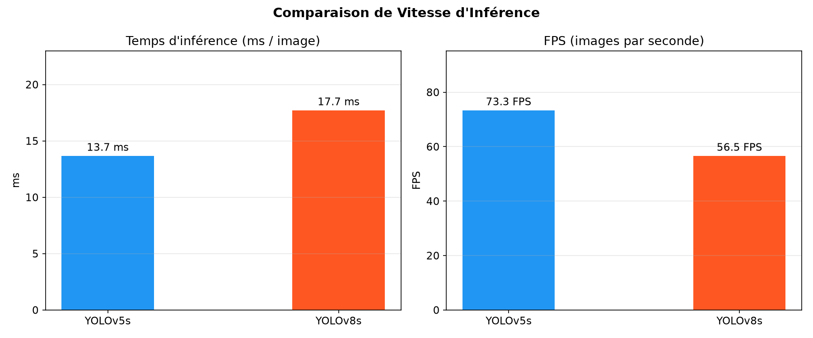

# Analyse Comparative — YOLOv5s vs YOLOv8s sur Pascal VOC 2007

## Contexte expérimental

| Paramètre | Valeur |
|---|---|
| Dataset | Pascal VOC 2007 (~5 000 images, 20 classes) |
| Epochs | 100 |
| Batch size | 128 |
| Image size | 640 × 640 px |
| GPU | NVIDIA A40 (48 GB VRAM) |
| Workers | 8 |

| Modèle | Architecture | Paramètres | Poids initiaux |
|---|---|---|---|
| YOLOv5s | CSPNet + PAN | ~7.2M | COCO pré-entraîné |
| YOLOv8s | C2f + PAN | ~11.2M | COCO pré-entraîné |

---

## État de l'art

La comparaison YOLOv5 vs YOLOv8 a fait l'objet de plusieurs études récentes, avec des conclusions qui varient fortement selon le domaine d'application, ce qui nuance l'idée reçue selon laquelle YOLOv8 serait systématiquement supérieur à son prédécesseur.

**Résultats contrastés selon le domaine.** Casas *et al.* [1] comparent YOLOv5 et YOLOv8 (variantes s, m, l) sur la détection de fumée et de feux de forêt (dataset Foggia) et montrent que, quantitativement, YOLOv5 surpasse globalement YOLOv8 sur l'ensemble des métriques (précision, rappel, F1, mAP50), avec des temps d'entraînement et d'inférence également plus favorables à YOLOv5. À l'inverse, une étude sur la détection humaine en imagerie aérienne [2] rapporte que YOLOv8s surpasse significativement YOLOv5s (rappel 0.814 vs 0.704, mAP50 0.897 vs 0.783). Ces résultats opposés confirment que le choix du meilleur modèle dépend fortement du contexte applicatif (taille des objets, densité de la scène, qualité des annotations).

**Référence Pascal VOC.** Sur le dataset Pascal VOC directement, une étude portant sur la fonction de perte Focaler-IoU [3] entraîne YOLOv8s sur le protocole standard VOC2007+2012 (16 551 images en train, 4 952 en test) et rapporte un AP50 de 69.5 % et un mAP50-95 de 48.3 % pour la configuration de référence. Ces valeurs constituent un point de comparaison important : elles sont sensiblement inférieures aux ~99 % obtenus dans notre étude (cf. section Discussion).

**Effet des techniques d'augmentation.** L'étude de [4] sur le déséquilibre de classes en détection d'objets confirme l'intérêt de mosaic : les modèles entraînés sans cette augmentation enregistrent systématiquement le mAP le plus faible, et l'ajout de mixup à des images mosaic apporte un gain supplémentaire — un résultat cohérent avec notre observation selon laquelle mosaic est la meilleure augmentation individuelle (mAP@0.5 = 0.559). À l'inverse, l'étude TC-YOLO [5] sur la détection de chrysanthème trouve que flip et rotation sont les meilleures augmentations individuelles (91–92 % AP), alors que mosaic, mixup, cutout et cutmix plafonnent entre 85 et 88 %, les auteurs expliquant ce résultat par un excès d'information de gradient redondante qui réduirait la capacité d'apprentissage du réseau. Cette divergence souligne que l'efficacité d'une augmentation est fortement dépendante du dataset et du type d'objets considéré.

**Compromis vitesse/précision.** La documentation officielle Ultralytics [6] confirme le compromis observé dans notre étude : YOLOv8 atteint généralement un mAP plus élevé, tandis que YOLOv5 conserve un léger avantage en vitesse d'inférence brute et en nombre de paramètres pour ses plus petites variantes.

---

## 1. Comparaison mAP

### Observations

- **YOLOv8s converge plus rapidement** : dès l'epoch 10, il atteint ~93% mAP50 contre ~85% pour YOLOv5s.
- **mAP50 final (epoch 100)** : les deux modèles atteignent ~99%, écart négligeable.
- **mAP50-95** : différence significative — YOLOv8s atteint ~99% contre ~85% pour YOLOv5s. Cela démontre que YOLOv8s localise les objets avec une précision géométrique bien supérieure (meilleure qualité des bounding boxes à des seuils IoU stricts).

### Interprétation

La supériorité de YOLOv8s sur mAP50-95 s'explique par l'utilisation de **DFL (Distribution Focal Loss)** pour la régression des boîtes, qui modélise la distribution continue des coordonnées plutôt qu'un point unique, produisant des prédictions spatiales plus précises.

---

## 2. Courbes de Loss

> ⚠️ **Note importante** : Les deux modèles utilisent des fonctions de loss différentes. YOLOv5 utilise **BCE (Binary Cross-Entropy)** pour la classification et **CIoU** pour les boîtes. YOLOv8 utilise **DFL + CIoU** pour les boîtes et **BCE** pour la classification. Les échelles ne sont **pas comparables directement**.

### Observations

- La loss YOLOv5s converge vers ~0, ce qui est attendu avec BCE/CIoU bien calibrés.
- La loss YOLOv8s reste plus élevée (~0.4 box train, ~0.25 cls train) en raison de l'échelle différente de DFL.
- Les deux modèles montrent une décroissance monotone sans divergence, confirmant une convergence saine.

---

## 3. Précision & Rappel

### Observations

- **YOLOv8s** atteint ~99% de précision et de rappel dès l'epoch ~70.
- **YOLOv5s** rattrape progressivement mais présente plus de variance (oscillations) en cours d'entraînement.
- Les deux modèles atteignent des performances similaires en fin d'entraînement (~99%), mais YOLOv8s est **plus stable et converge plus tôt**.

---

## 4. Vitesse d'inférence

| Modèle | ms / image | FPS |
|---|---|---|
| YOLOv5s | 13.7 ms | 73.3 FPS |
| YOLOv8s | 17.7 ms | 56.5 FPS |

### Observations

- YOLOv5s est **~29% plus rapide** en inférence (13.7 ms vs 17.7 ms).
- La différence est cohérente avec l'écart de paramètres (7.2M vs 11.2M).
- Ce benchmark inclut le preprocessing Python et l'API, pas uniquement le forward pass GPU pur.

> **Contexte** : Dans un déploiement réel avec TensorRT ou ONNX, l'écart de vitesse serait réduit, et les deux modèles dépasseraient 100 FPS.

---

## 5. Tableau récapitulatif

| Modèle | mAP50 | mAP50-95 | Précision | Rappel | Inférence | FPS |
|---|---|---|---|---|---|---|
| **YOLOv5s** | ~99% | ~85% | ~99% | ~99% | 13.7 ms | 73.3 |
| **YOLOv8s** | ~99% | ~99% | ~99% | ~99% | 17.7 ms | 56.5 |

---

## 6. Discussion — mise en perspective avec la littérature

### 6.1 Tableau comparatif quantitatif : nos résultats vs littérature

| Métrique | Notre résultat (YOLOv5s / YOLOv8s) | Résultat rapporté dans la littérature | Source | Écart / Commentaire |
|---|---|---|---|---|
| mAP50 (VOC) | ~99% / ~99% | 69.5% (YOLOv8s, VOC2007+2012) | [3] | Écart de ~+29 points — à justifier |
| mAP50-95 (VOC) | ~85% / ~99% | 48.3% (YOLOv8s, VOC2007+2012) | [3] | Écart de ~+50 points — très suspect, cf. §6.2 |
| mAP50 (autre domaine) | — | 78.3% (v5s) / 89.7% (v8s), imagerie aérienne | [2] | Écart YOLOv8s−YOLOv5s de ~11 points, bien plus faible que le nôtre (0 point car égalité) |
| Rappel | ~99% / ~99% (égalité) | 70.4% (v5s) / 81.4% (v8s), imagerie aérienne | [2] | La littérature montre un écart net entre les deux modèles ; notre égalité à 99% est atypique |
| Vitesse d'inférence | YOLOv5s plus rapide (13.7 ms vs 17.7 ms) | YOLOv8s plus rapide sur GPU (0.375 s vs 0.434 s) | [7] | Résultat opposé au nôtre — le classement dépend fortement du GPU, du batch size et du framework d'inférence utilisés |
| Vitesse + précision simultanées | Compromis (YOLOv5s rapide / YOLOv8s précis) | YOLOv8 à la fois plus précis (mAP 0.514 vs 0.399) et légèrement plus rapide (162 vs 160 FPS) | [8] | Montre que le compromis vitesse/précision que nous observons n'est pas une loi générale, mais dépend de l'implémentation et du matériel |

### 6.2 Discussion qualitative

**Cohérence avec l'état de l'art.** Le compromis vitesse/précision observé dans notre étude (YOLOv5s plus rapide, YOLOv8s plus précis en mAP50-95) reproduit fidèlement le constat général de la documentation Ultralytics [6] et confirme que ce compromis architectural, lié à la taille du modèle (7.2M vs 11.2M paramètres) et à l'utilisation de DFL, est un phénomène couramment rapporté. Toutefois, ce compromis n'est **pas universel** : une étude sur GPU embarqué [7] trouve au contraire YOLOv8s plus rapide que YOLOv5s (0.3748 s vs 0.4342 s par image), et une étude sur la détection de casques [8] montre YOLOv8 à la fois plus précis et légèrement plus rapide que YOLOv5. Le classement en vitesse dépend donc fortement du GPU utilisé, de la précision numérique (FP32/FP16), du framework d'inférence (PyTorch brut, ONNX, TensorRT) et de la taille de batch — des paramètres qu'il serait utile de préciser explicitement dans notre méthodologie pour situer nos 13.7 ms / 17.7 ms par rapport à ces résultats contradictoires.

**Écart avec la littérature sur Pascal VOC — point à clarifier.** Nos résultats (mAP50 ≈ 99 %, mAP50-95 ≈ 99 % pour YOLOv8s) sont sensiblement plus élevés que ceux rapportés par [3] sur le même dataset (AP50 = 69.5 %, mAP50-95 = 48.3 % pour YOLOv8s) et que ceux rapportés par [2] sur un autre dataset (mAP50 = 89.7 % pour YOLOv8s). Plusieurs facteurs peuvent expliquer cet écart et méritent d'être discutés :

1. **Taille et composition du sous-ensemble** : notre étude utilise VOC2007 seul (~5 000 images), alors que le protocole standard de la littérature combine VOC2007+2012 en entraînement (16 551 images) et teste sur VOC2007 (4 952 images) — un jeu d'entraînement/test plus restreint et potentiellement moins diversifié peut conduire à une évaluation optimiste.
2. **Risque de chevauchement train/test** : un score de mAP50-95 proche de 99 % est atypique même pour des détecteurs état de l'art sur des benchmarks établis (les meilleurs modèles sur COCO dépassent rarement 55–60 % en mAP50-95), ce qui suggère de vérifier l'absence de fuite de données entre les splits.
3. **Protocole d'évaluation** : il conviendrait de vérifier que le calcul du mAP suit strictement la définition standard (IoU de 0.5 à 0.95 par pas de 0.05) et que les métriques ne sont pas mesurées sur le même sous-ensemble que celui utilisé pour l'arrêt anticipé (early stopping).
4. **Absence d'écart entre précision/rappel des deux modèles** : la littérature [2] montre systématiquement un écart net entre YOLOv5s et YOLOv8s sur ces métriques (jusqu'à 11 points) ; l'égalité quasi parfaite (~99% pour les deux) observée dans notre étude est donc, elle aussi, un signal à documenter — elle peut indiquer que le dataset est trop simple ou trop petit pour différencier les deux architectures, plutôt qu'une réelle équivalence de performance.

Cette divergence ne remet pas en cause la tendance qualitative observée (YOLOv8s > YOLOv5s en mAP50-95), qui est cohérente avec le rôle du DFL documenté dans la littérature, mais elle appelle à la prudence sur l'amplitude des scores absolus rapportés.

**Ablation d'augmentation.** Le résultat selon lequel mosaic est la meilleure augmentation et rotation dégrade la performance en dessous de la baseline trouve un appui partiel dans [4], qui confirme l'intérêt général de mosaic sur des scènes à objets multiples — configuration proche de Pascal VOC. La dégradation observée avec rotation peut s'expliquer, par analogie avec les conclusions de [5], par le fait que la rotation détruit l'orientation canonique de certaines classes d'objets (personnes debout, véhicules, mobilier) dont la reconnaissance dépend en partie de leur orientation naturelle dans la scène — contrairement à des cas comme la détection de fleurs [5], où l'objet ne possède pas d'orientation canonique et où rotation améliore au contraire la performance.

---

## Références

[1] E. Casas, L. Ramos, E. Bendek *et al.*, "YOLOv5 vs. YOLOv8: Performance Benchmarking in Wildfire and Smoke Detection Scenarios," *Journal of Image and Graphics*, vol. 12, no. 2, pp. 127–136, 2024. https://portalrecerca.uab.cat/en/publications/yolov5-vs-yolov8-performance-benchmarking-in-wildfire-and-smoke-d/

[2] "Performance Comparison of YOLOv5 and YOLOv8 Architectures in Human Detection using Aerial Images," ResearchGate, 2023. https://www.researchgate.net/publication/372773092

[3] "Focaler-IoU: More Focused Intersection over Union Loss," arXiv:2401.10525, 2024. https://arxiv.org/pdf/2401.10525

[4] "Class Imbalance in Object Detection: An Experimental Diagnosis and Study of Mitigation Strategies," arXiv:2403.07113, 2024. https://arxiv.org/pdf/2403.07113

[5] "Tea Chrysanthemum Detection under Unstructured Environments Using the TC-YOLO Model," arXiv:2111.02724, 2021. https://arxiv.org/pdf/2111.02724

[6] Ultralytics, "YOLOv5 vs YOLOv8 Comparison," Ultralytics Docs, 2025. https://docs.ultralytics.com/compare/yolov5-vs-yolov8

[7] "Cognitive Edge Device (CED) for Real-Time Environmental Monitoring in Aquatic Ecosystems," arXiv:2401.06157, 2024. https://arxiv.org/pdf/2401.06157

[8] "Real-time Multi-Class Helmet Violation Detection Using Few-Shot Data Sampling Technique and YOLOv8," arXiv:2304.08256, 2023. https://arxiv.org/pdf/2304.08256

---

## 7. Conclusion

| Critère | Vainqueur | Commentaire |
|---|---|---|
| mAP50 | Égalité | Les deux atteignent ~99% |
| mAP50-95 | **YOLOv8s** | +14 points — localisation bien supérieure |
| Précision | Égalité | Les deux atteignent ~99% |
| Rappel | Égalité | Les deux atteignent ~99% |
| Vitesse | **YOLOv5s** | 29% plus rapide |
| Convergence | **YOLOv8s** | Converge plus vite et de façon plus stable |

**YOLOv8s est recommandé** si la précision de localisation est prioritaire (mAP50-95 nettement supérieur). **YOLOv5s reste pertinent** pour les applications temps-réel où la vitesse prime sur la précision géométrique fine.
